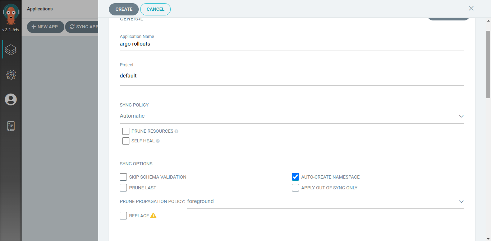
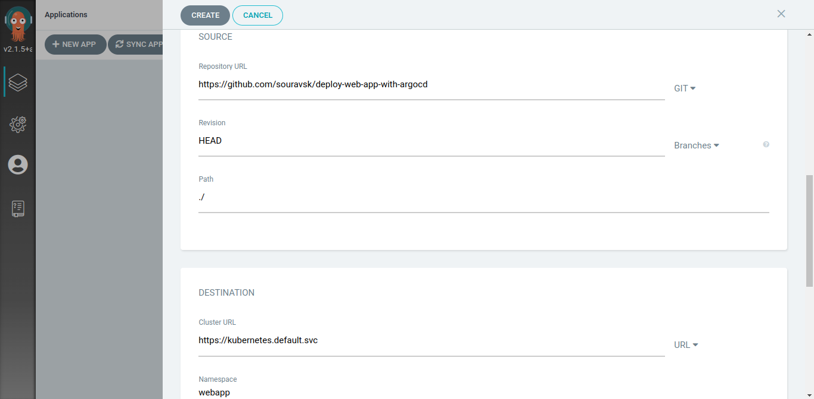
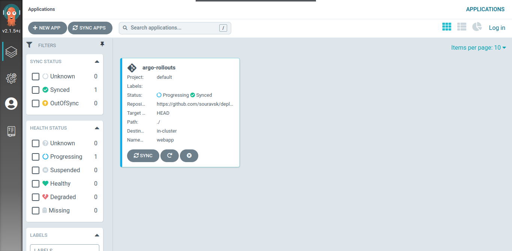
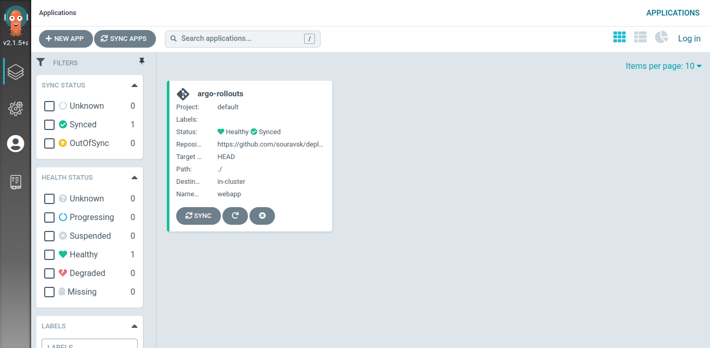
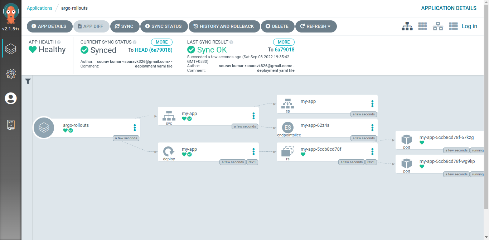

# Deploying your web application with ArgoCD
In this Project, we will deploy a web page which is in a docker image. That we have done in my previews project Go here

To that, we need to create a deployment and Service YAML file which will be used in the deployment of the web app in the Kubernetes

##### Step 1
- First, we need to have the ArgoCD application Deployed in the Kubernetes cluster. 
- You can use minikube or any Kubernetes cluster to install the ArgoCD application in the cluster. To do that go Here
- 
##### Step 2
Now Your ArgoCD is set up so let's deploy our web application.
> Make sure you have logged in to the argocd application in the GUI because we are going to use the GUI to deploy it.

This is how it looks like when you open the ArgoCD Application

##### Step 3
Now we will Click on the **New App** to add the application or to deploy the application on Kubernetes.
when you click on that it will look like this.
Now, this most important part because if you made any mistake it will be a thorough error.

##### Step 4
Now You just have to fill this out only 

- **Application name** : Argo-rollouts
- **Project**: Default
- **SYNC POLICY**: automatic
- **AUTO-CREATE Namespace**: enabled
- **Repository URL**: https://github.com/souravsk/deploy-web-app-with-argocd
- **Path**: ./
- **Cluster**: https://kubernetes.default.svc (this is the same cluster where ArgoCD is installed)
- *Namespace**: Argo-rollouts

It will look like this after you will fill in all the required files.

##### Step 5
After filling in all this now click on the **create** to create. it will take some seconds to process

##### Step 6
If everything gets well then your application is now deployed 

Now click on that and you will the how your deployment 

As you can see the health is good and the application is synced.

Nice work!!!!!
